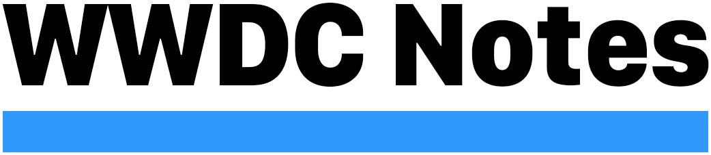

    

Welcome to **[WWDC Notes][website]**'s repository, _an open source and community-driven effort to collect notes from all Apple's WWDC videos_.

# Introduction

WWDC is fantastic for many reasons:  
Apple announces new major OS releases, new frameworks are unveiled, current frameworks are revamped, and much more.

The amount of new WWDC content every year is incredible and, sometimes, watching these videos is the only way to understand how things work, or how to make them work.

WWDC Notes can be used as a quick recap of what was presented, as a reference, or even as a time-saver, since watching all WWDC videos takes hundreds of hours.

Perhaps more importantly, [Apple's video archive][ava] only keeps around WWDC videos from the last 3-4 years: WWDC Notes is also a preservation place for sessions whose videos are no longer available.

In this repository you can find all the WWDC sessions notes available in the [main website][website], all notes are written in [Markdown][markdownSpec].

**Everyone** can contribute to building WWDC notes: find what's missing [here][wm], and we look forward to having you part of the community! Thank you.

[wm]: https://www.wwdcnotes.com/what-s-missing/
[ava]: https://developer.apple.com/videos/
[wnc]: https://www.wwdcnotes.com/community/

# Contributing

Everyone is very welcome to add any missing session (from any year!) and/or enhance any of the current ones. It doesn't matter how little, _every_ contribution is welcome ❤️

For more information, please refer to the [CONTRIBUTING.md][contributing] document.

# Credits

[WWDC Notes][website] is built by [Federico Zanetello][twitter] as a [FIVE STARS][5SWebsite] project, and it is generated using [Publish][publish].

# Legal

All content copyright © 2012 – 2022 Apple Inc. All rights reserved.  
Swift, the Swift logo, Swift Playgrounds, Xcode, Instruments, Cocoa Touch, Touch ID, FaceID, iPhone, iPad, Safari, App Store, iPadOS, watchOS, tvOS, Mac, and macOS are trademarks of Apple Inc., registered in the U.S. and other countries.  
This repository is not made by, affiliated with, nor endorsed by Apple.

[5SWebsite]: https://fivestars.blog
[contributing]: CONTRIBUTING.md
[markdownSpec]: https://daringfireball.net/projects/markdown/
[publish]: https://github.com/JohnSundell/Publish
[twitter]: https://twitter.com/zntfdr
[website]: https://www.wwdcnotes.com
