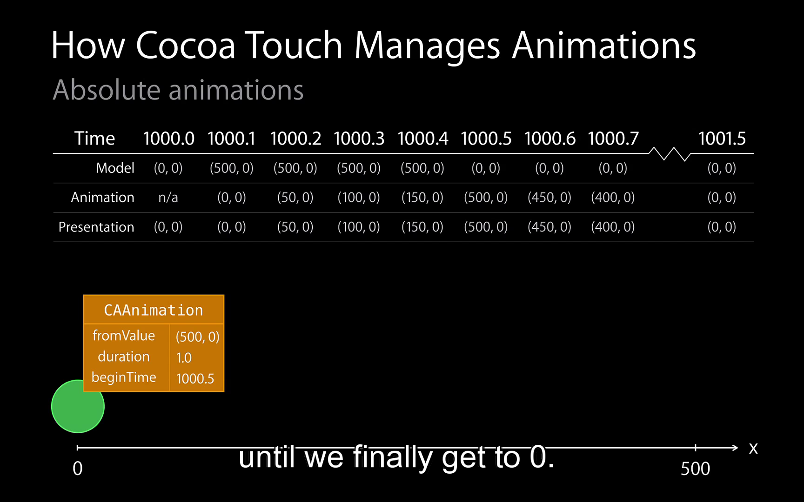
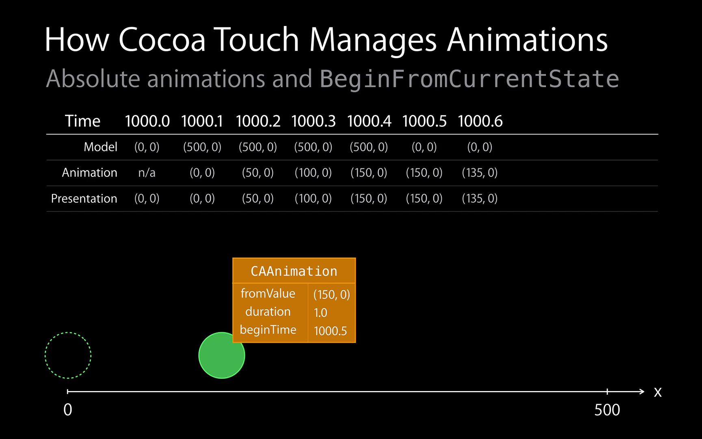
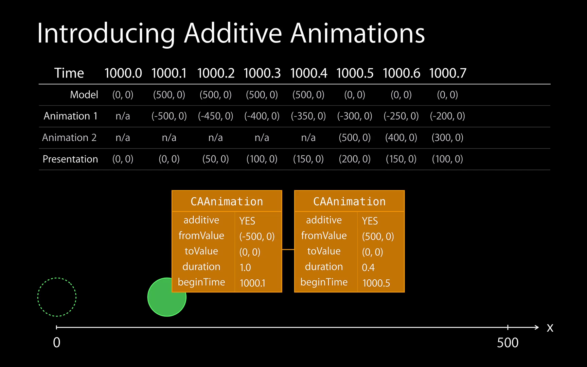
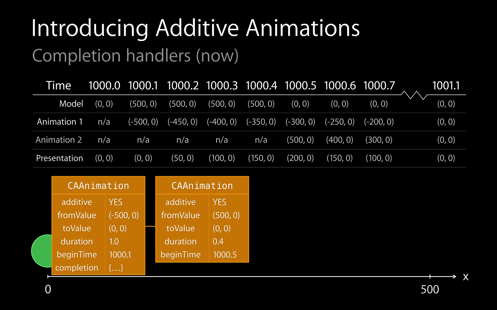
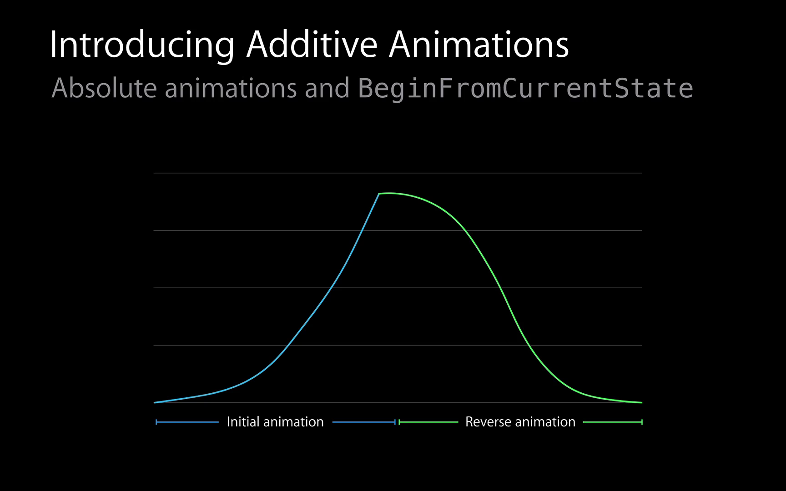

## From Gesture to Animation
We have a few options here to implement this:

### 1. Using UIView animateWithDuration

This actually executes in another process out of context of your application. The render server(like back end) at a higher priority will make sure not dropping any frame on that animation, even the main thread is running a heavy work or blocked by some tasks. It would be easy to have a smooth animation if offload animation onto the render server by using animateWithDuration method.

### 2. UIDynamicAnimator

Everything happening is in your process.
Downside: it's easy to drop animate frame using this tech when thread is busy working on some task.

### 3. CADisplayLink
> This is where UIDynamicAnimator built on.
> This calls you back once every frame.

### 4. NSTimer

Not recommended, highly possible to drop frames.

## From Animation to Animation

### Absolute Animation

| Absolute Animation | Absolute Animation and Begin from Current State |
| ------------------------- | ------------------------------- |
|  |  |

### Additive Animation

- Smoother transitions on iOS 8 by default 
- Still use BeginFromCurrentState if unsure
- Completion handlers may stack, since the change of animation would not stop or cancel the old animation, it actually create a new animation. Both of them would be finished.

| Additive Animation | Completion Handler |
| ------------------ | -------------- |
|  |  |

| Absolute Animation | Additive Animation |
| ------------------ | -------------- |
|  | |
