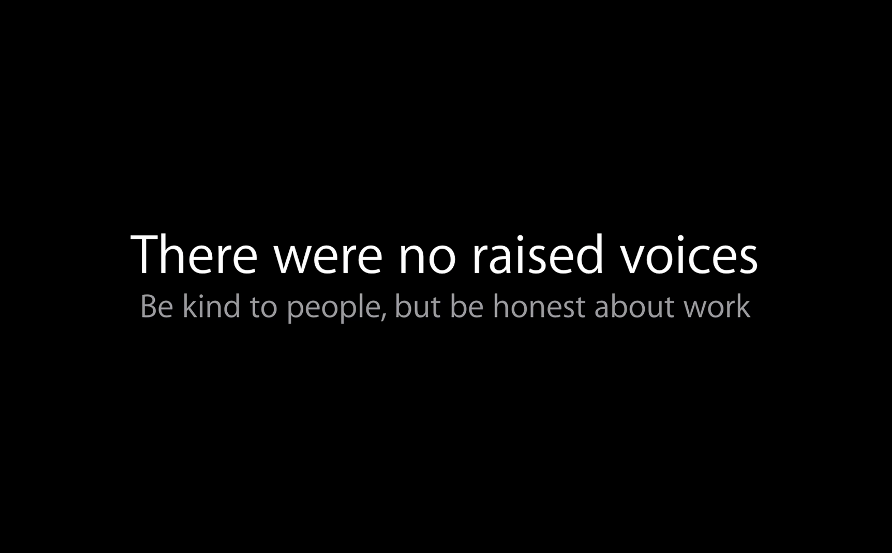
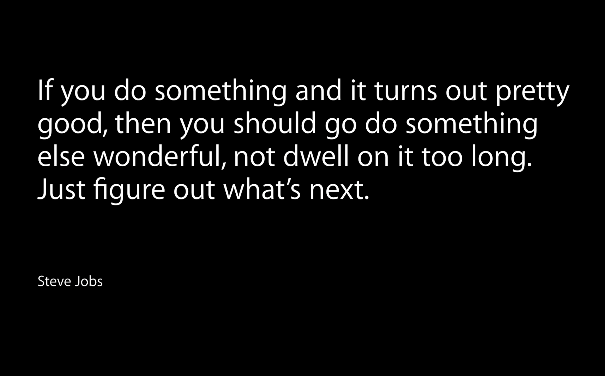

- Know a good idea when you see it 

- Don't try to solve every problem at once 

- Find smart friends and listen to them 

- Work should explain itself

- Choose the simplest thing which might work

- Only show your best work

- Iterating quickly leads to better work

- Be kind to people, but be honest about work 

- Separate yourself from your work 

- You’re never done

