> Related : [Introducing Sign In with Apple - WWDC19](https://github.com/HARlBO/WWDC/blob/master/WWDC2019/Introducing-Sign-In-with-Apple.md)

##  Creating a secure request

```swift
// Configure request, setup delegates and perform authorization request
@objc func handleAuthorizationButtonPress(){ 
	let request = ASAuthorizationAppleIDProvider().createRequest() 
	request.requestedScopes = [.fullName, .email]

	request.nonce = myNonceString()
	request.state = myStateString() 

  let controller = ASAuthorizationController(authorizationRequests: [request]) 

  controller.delegate = self 
  controller.presentationContextProvider = self 

  controller.performRequests() 
}
```

These `nonce` and `state` properties will allow you to verify that the authorization and credential you get after executing a request are the ones you were expecting.

### Securing your request

#### Nonce

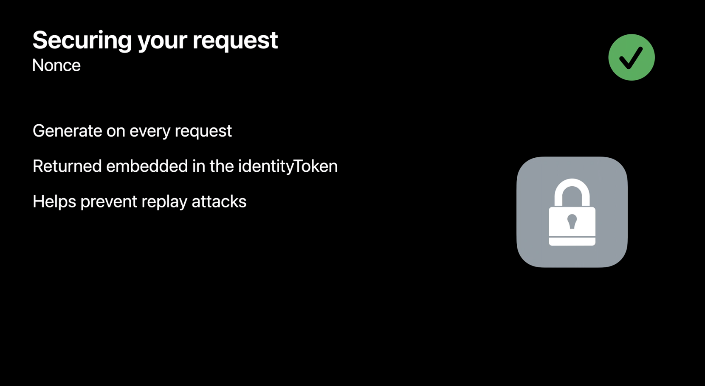

The nonce is an opaque blob of data sent as a string in the request.

It is important to generate one unique nonce every time you create a new request as later on you will be able to verify this value.

This will allow you to verify this value in your server, helping prevent replay attacks.

#### State

The state value is also an opaque blob of data sent with the request.

**Once key difference he has with the nonce value is that the state will be returned in the credential allowing you to locally match a credential to a request and verify this was generated from your application**.

### Private email relay


Example on how to get a credential from an authorization

```swift
// ASAuthorizationControllerDelegate 

func authorizationController(
	controller: ASAuthorizationController,
	didCompleteWithAuthorization authorization: ASAuthorization
) { 
	if let credential = authorization.credential as? ASAuthorizationAppleIDCredential {
		let userIdentifier = credential.user
		let fullName = credential.fullName
		let email = credential.email 
		let realUserStatus = credential.realUserStatus 
		
		let state = credential.state
		let identityToken = credential.identityToken
		let authorizationCode = credential.authorizationCode 

    // Securely store the userIdentifier locally 
    self.saveUserIdentifier(userIdentifier) 

    // Create a session with your server and verify the information
    self.createSession(
    	identityToken: identityToken, 
    	authorizationCode: authorizationCode
    ) 
	}
}
```

Inside of credential you will find properties containing the user information that you requested like name and email. You will also find important properties that will allow you to securely verify the request and create a session with your servers.

### Verifying Credentials

#### Response

- Cache the objects locally
It is important to cache the objects you need in case of the failure communicating with your server due to poor connectivity.
- Verify the state value
Make sure you verify the state value of the credential to be the same state value you previously generated.
- Validate the information with Apple
The response contains an authorization code an identity token. Send these values to your server where they can be decoded. Once decoded, verify the received information as well as session with Apple servers.

**How will the entry token will look when decoded by your server**

```json
{
  "iss": "https://appleid.apple.com",
  "aud": "<Bundle Identifier>",
  "exp": 1591157663,
	"iat": 1591157063, 
	"sub": "001888.df37b9a8a63a423a8d80a5fc2069e308.1756",
	"nonce": "a3315daf11b",
	"c_hash": "glOEj05pyJV9JdNzc2nhqQ",
	"email": "4r8ihiunz7@privaterelay.appleid.com", 
	"email_verified": true, 
	"is_private_email": true, 
	"auth_time": 1591157063, 
	"nonce_supported": true, 
	"real_user_status": 1
}
```

- `subject` : A user identified that was returned to you on the authorization and will allow to create a session in your servers.
- `nonce` : Verify these to be the same nonce you generated previously in the request. This will allow you to verify the authenticity of the authorization and help mitigate replay attacks.
- `real_user_status` : `0` - unsupported, `1` - unknown, `2` - likely real

#### Identity token and authorization code


You can exchange the authorization code with the Apple ID servers. And when this is successful you will receive a refreshed token and an access token for future calls as well as a new identity token that should be identical to the one you already have.

You may verify a refresh token once a day to confirm that the user's Apple ID on that device is still in good standing.

##  Credential state changes

```swift

// Getting a credential state 
let provider = ASAuthorizationAppleIDProvider()

provider.getCredentialState(
	forUserID: getstoredUserIdentifier()
) { credentialState, error in 
	switch credentialState {
		case .authorized: 
      // Sign in with Apple credential Valid 
    case .revoked: 
      // Sign in with Apple credential Revoked, Sign out 
    case .notFound: 
      // Credential was not found, fallback to login screen 
    case .transferred: 
      // Application was recently transferred, refresh User Identifier 
    @unknown default: 
      break 
  }
}
```

`getCredentialState` API allows you to verify the current state of a credential by sending the currently stored user identifier.

It is important that this method is called every time your application is launched or changes to the foreground. That way you will be able to react on time to any changes in status and present the appropriate scheme in your application to your user.

- `.authorized` : You can fast track the user directly to your application and skip the login UI.
- `.revoked` : The user decided to sign out of your application. In this scenario you should sign the user out of your application. Close your session and present the login screen
- `.notFound` :  This will be returned when there was no credential matching the user identifier. Present a login screen so that the user can authenticate your application.
- 🆕 `.transferred`

### 🆕 Transferred State

- Ownership changed
This will only be received by application that recently were transferred from one development team to another. (ex. after a company's acquired)
- User migration needed
User identifiers are unique to a team. So when transferring ownership of an application, the existing user will need to be migrated to a new user identifier to match the new team.
- Silent migration
This migration is handled silently. This is without any user interaction and can be triggered calling the same API used to create a new account or logging the user.

```swift
// Migrating a user identifier 
let request = ASAuthorizationAppleIDProvider().createRequest()
request.requestedScopes= [.fullName, .email]

request.user = getStoredUserIdentifier() 

request.nonce = myNonceString() 
request.state = myStateString() 

let controller = ASAuthorizationController(authorizationRequests: [request])

controller.delegate = self 
controller.presentationContextProvider = self 

controller.performRequests() 
```

We can validate the transfer state of the user and generate the new user identifier that will match the new team.

##  Server notifications

### 🆕 Server to server developer notifications

Listening to these notifications will allow you to monitor things like credential state changes right from your server as well as receive other types of events.

- Register 
You have to register your server endpoint on the Apple developer's website.
- JWT Event
Events will be sent as JSON web tokens signed by Apple.

```json
{
  "iss": "https://appleid.apple.com/", 
  "aud": "<Bundle Identifier>",
  "iat": 1508184845,
  "jti": "<unique events stream id>", 
  "events": [ 
  	{
  	  "type": "email-enabled", 
  	  "sub": "<user_id>", 
  	  "email": "<email@privaterelay.appleid.com>",
  	  "is_private_email": true,
  	  "event_time": 1508184845 
  	}
  ]
}
```

The `email-disabled` event which you can get if a user has decided to stop receiving emails on their email relay. The email enabled event means that the user opted back into receiving email messages.

It is important to note that this event as well as the email disabled will only be sent when the user previously decided to use a private email relay for their account.

```json
{
  "iss": "https://appleid.apple.com/", 
  "aud": "<Bundle Identifier>",
  "iat": 1508184845,
  "jti": "<unique events stream id>", 
  "events": [ 
  	{
  	  "type": "email-enabled", 
  	  "sub": "<user_id>", 
  	  "event_time": 1508184845 
  	}
  ]
}
```

The `consent-revoked` event will be sent to you when a user decided to stop using their AppleID with your application and should be treated as a sign out by the user.

##  Sign in with Apple Button

### 🆕 SwiftUI support

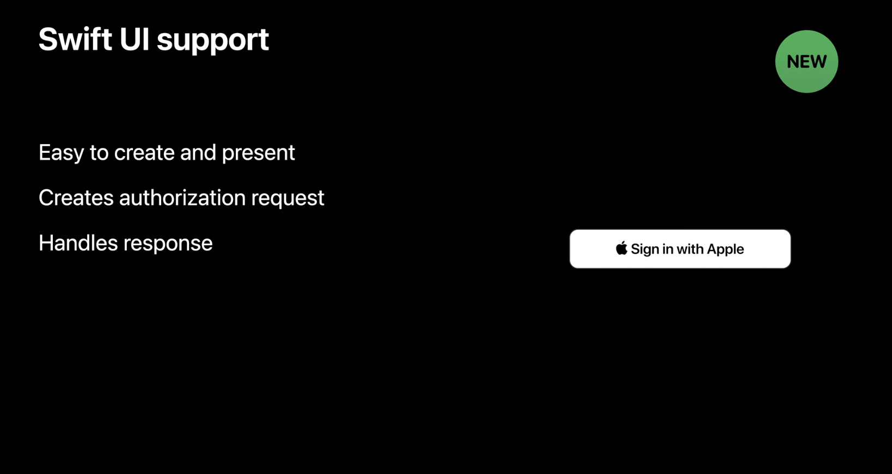

```swift
// SwiftUI example: 

SignInWithAppleButton(.signIn) { 
	onRequest: { request in 
    request.requestedScopes = [.fullName, .email]
    request.nonce = myNonceString()
    request.state = myStateString() 
  } 
  onCompletion: { result in 
  	switch result { 
      case .success(let authorization): 
        // Handle Authorization 
      case .failure(let error): 
        // Handle Failure 
    }
  }
}.signInWithAppleButtonStyle(.black) 
```

`onRequest` : This is the right place to add the requested scopes like name and email and the nonce state values.

`onCompletion` : We will get the result of the request and handle the success or failure cases just as you would on the delegate methods for the authorization controller.

`.signInWithAppleButtonStyle` : We can also select the Button style.

#### Styles

- Black
- White
- White outline

If you need to personalize the Sign in with Apple Button more to match the specific design of your website or application → a new online portal

### 🆕 Online Button editor

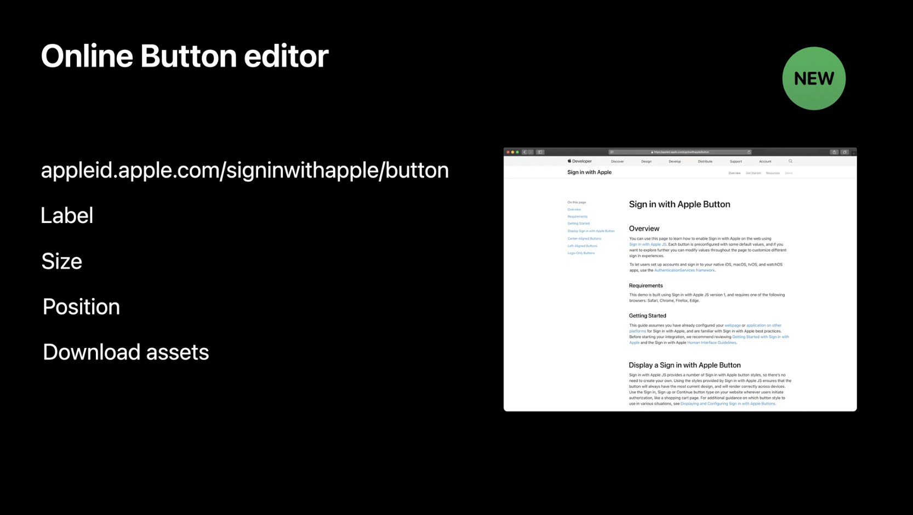

[https://appleid.apple.com/signinwithapple/button](https://appleid.apple.com/signinwithapple/button)

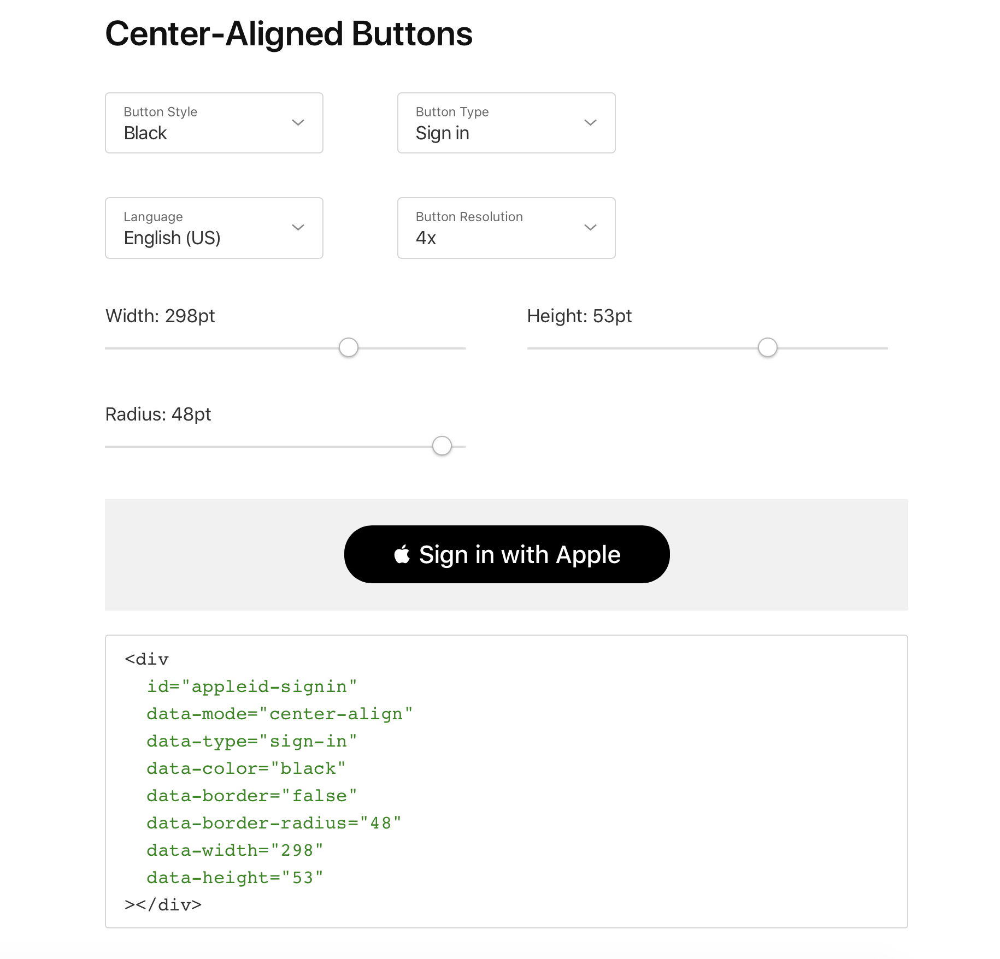

##  🆕 Upgrading  to Sign in with Apple

What about users that are already using a traditional username and password based account and don't want to fork their current account?

- Secure
It's secure for both you and your users. Upgrading to Sign in with Apple is the easiest way to convert your accounts to two factor authentication.
- Reduce complexity
Account recovery is also a lot less complicated with Sign in with Apple.
- Prevent duplicate accounts
Utilizing this API will prevent the duplication of accounts.

→ Users that are already using a traditional username and password based account won't abandon their current account, they can just upgrade.

### Overview

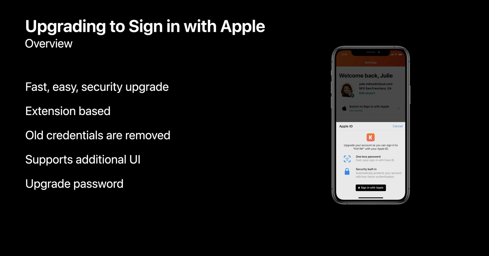

> One Tap Account Security Upgrades - WWDC20

### Three flow for upgrades
||||
|-|-|-|
|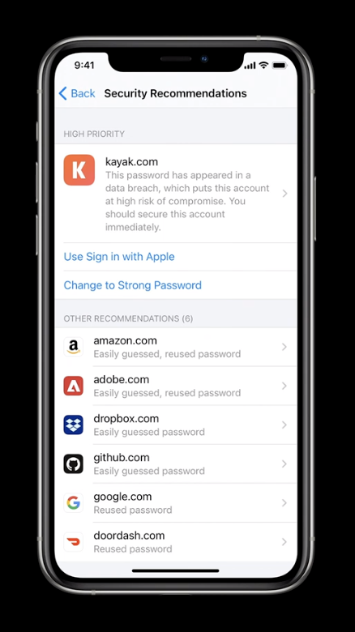|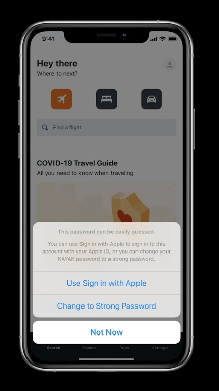|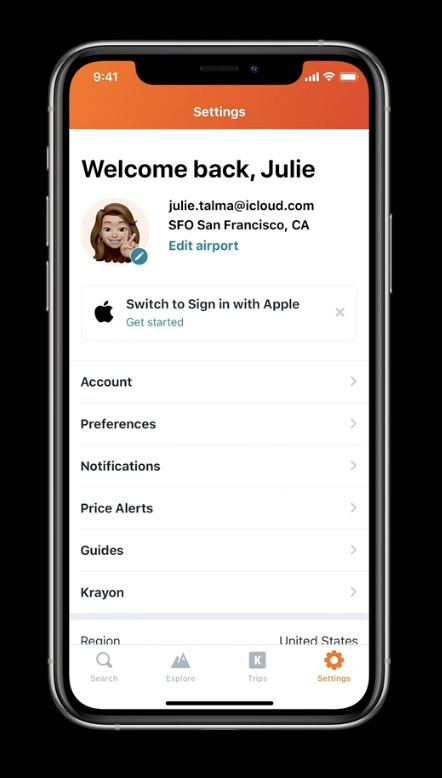|

1. When security recommendations identifies a weak credential in the new password manager and settings. 
2. When a user is interacting with your app utilizes password autofill and the selected credential is a weak credential.
3. When you invoke the new authentication services API via a user interaction that you specify within your app 

### ASAccountAuthenticationModificationViewController

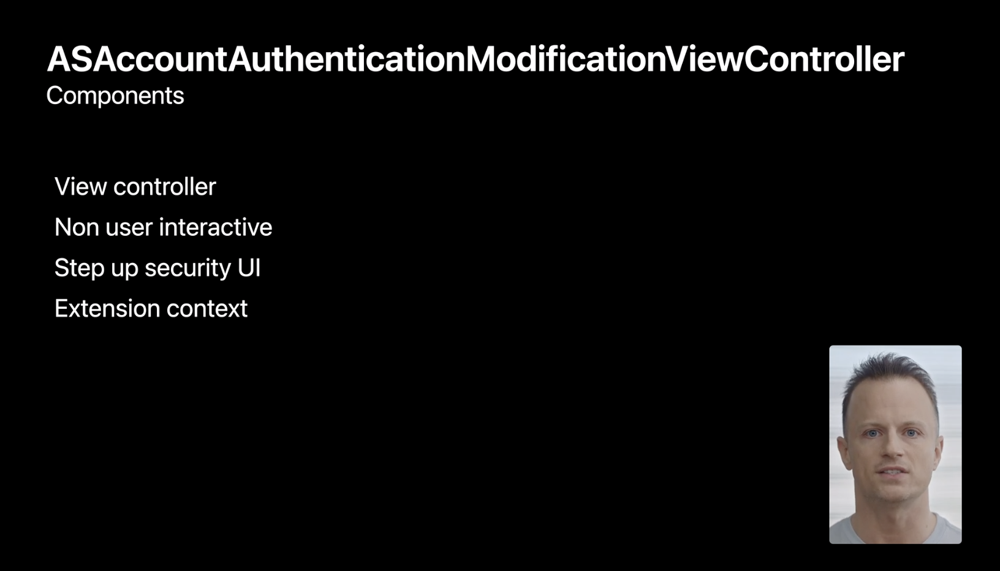

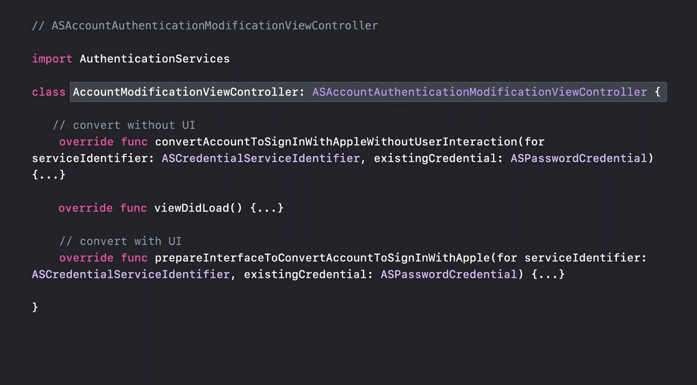

- `convertAccountsToSignInWithAppleWithoutUserInteraction`  : 
Called initially by the extension hosting process in an attempt to upgrade the credential without user interaction.
- `viewDidLoad` : This can be used to set up an intermediary user interface for the security step of flow if necessary. Providing intermediary UI to indicate progress might help provide the best user experience.
- `prepareInterfaceToConvertAccountToSignInWithApple` : 
This is called just prior to your view appearing. It gets past the same ASPasswordCredential provided is a non user interaction flow.

### Extension context

- ASAccountAuthenticationModificationViewController
Used to control the flow of the upgrade.
- Authorization
It has function to request Sign in with Apple authorization.
- Request UI
If you're evaluating the credential or currently signed in account and determined that additional UI is needed to verify the account the extension context is used to request that the step up security UI is displayed.
- Complete
This removes the existing credential.
- Cancel
The extension context is also used in cases which you need to cancel the flow entirely.

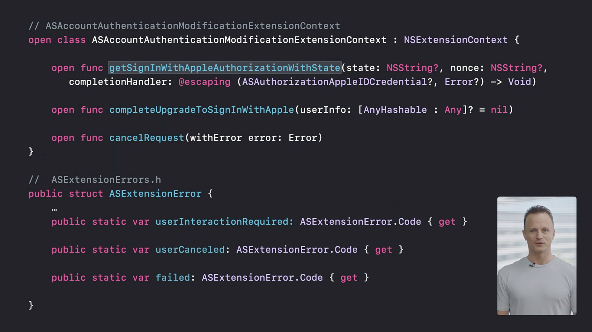

- `getSignInWithAppleAuthorizationWithState` :
Displays the Sign in with Apple UI with your apps information asking the user to authorize the upgrade. Request in upgrade flows `nonce` and `state` is passed as a parameter to this call.
- `completeUpgradeToSignInWithApple` :
This lets the extension hosting process know that authorization completed successfully resulting in the removal of the password credential.
- `cancelRequest`
- `userInteractionRequired` :
If your extension determines that additional UI needs to be shown to the user.
- `userCanceled` :
If your canceled while within your UI flow utilize that user cancelled ever.
- `failed` :
All other failures can use the failed error.

### Account authentication modification extension

#### Prepare to convert without UI

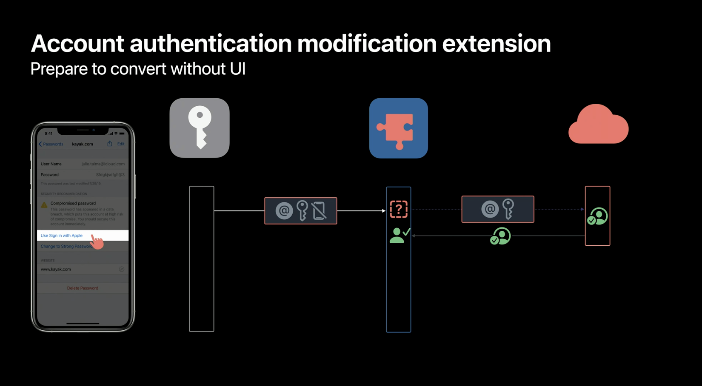

1. We begin the flow in the OS when toe user interacts with a weak credential and wants to upgrade that credential to Sign in with Apple.
2. Your account modification extension is initialized by the password managing process.
3. And the convert without UI function is called providing the password credential intended to be upgraded to Sign in with Apple.
4. The extension's job is to evaluate the past credential to make sure it is valid prior to upgrading to Sign n with Apple
(At this point checking too see if the username matches the currently signed in user is a good first course of action.)
5. The extension determined that the state of the signed in user and the pass credential requires a call to the server to verify the account.
6. The server verifies the credential and the authentication is a success.
7. The server then replies back to the extension confirming that the account is ready to be upgraded to Sign in with Apple.
8. The account is confirmed as authenticated and eligible for upgrade the extension context would be used to request the Apple ID credential.

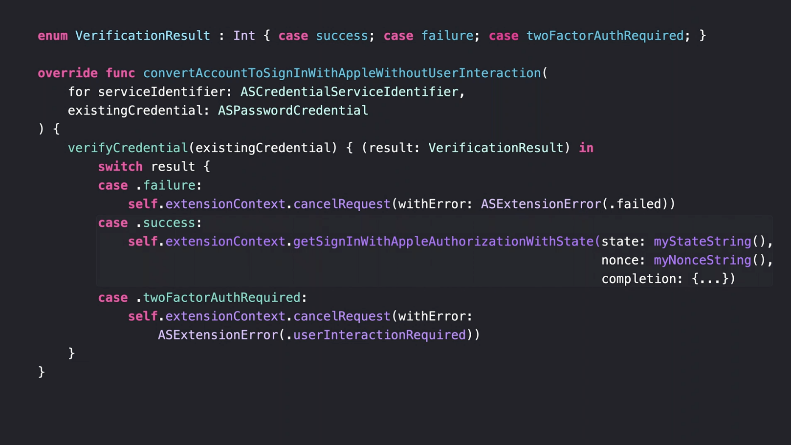

`verifyCredential`  
→ When the existing credential is verified one of these three values would get returned.

- `.failure` : Result for cases such as when the server attempts to validate the credential but the account or service date is not appropriate for converting the account at that time.
- `.success` : This indicates that the account is ready to be converted right away.
- `.twoFactorAuthRequired` : This means that we need to show some UI to the user. The  credential alone is not enough to upgrade.

### Request UI only if needed

To avoid users having to do extra work in most cases where a user is already authenticated in your app. 

### Converting with UI

There could be circumstances where UI flows might be warranted.

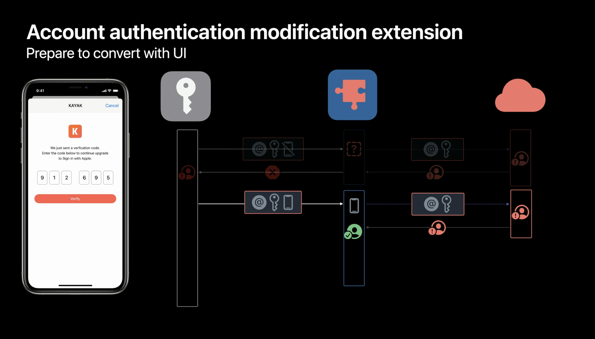

1. After the extension contacts cancelled with the user interaction required error, the password managing process initializes a new instance of the account modification view controller
2. And calls it prepared to convert with your function. Passing the ASPasswordCredential.
(At this point, the extension's ViewController is presented providing Intermediary UI such as a spinning gear.)
3. Utilizing the same credentials as earlier with perhaps a slight change of context a request is made to the back end.
4. The server attempts to verify the account. Requires two F.A and sends a rely back to the extension.
5. The extension updates the view asking the user for two factor authentication.
6. The user provides the verification code which the extension would then verify.
7. If the user could not be verified at this point, the extension context would be used to cancel the flow with the failed error.
8. If the user provide a valid code and verification is a success, the extension is now ready to request the AppleID credential.

### Upgrading account

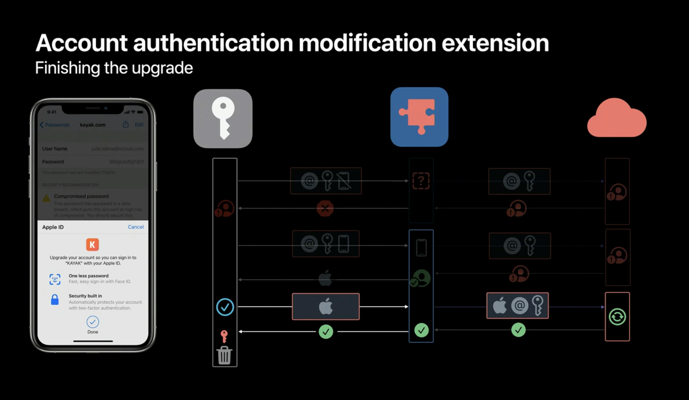

1. It is important to secure your request, to do so your extension would generate a state and nonce and pass them as parameters for the getAppleIDCredential call.
2. This results in an upgrade to Sign in with Apple UI being displayed to the user.
3. The user then authorizes using Face ID.
4. The AppleIDCredential is provided to the extension in the completion block of the getAppleIDCredential call.
5. The extension would then verify the credentials stay properly as being the same generated earlier.
6. The extension would them request an upgrade of the account providing the necessary account information and the AppleIDCredential to the server back end, so the account can be converted.
7. The back end would then exchange the authorization code with Apple servers verifying the value of the nonce in the identity token.
8. And if successful perform a conversion of the account. 
9. After converting,  it sends a reply back with a success value. It is important to note again that if the servers operation failed the extension contact should be used to call cancel with error with the failed error.
10. This time the server is indicating success. So the extension will perform any required bookkeeping and then call a complete upgrade to Sign in with Apple on the extension context.
11. This result in the password manager removing the existing credential and with that the flow is completed.

**Utilizing this API** →

- Improving user security
- Avoid confusion
- Convenient

ᵗʱᵃᵑᵏઽ ⠒̫⃝♡ 

