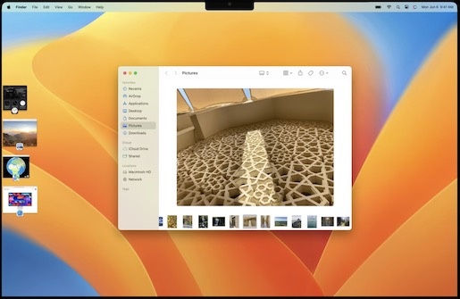
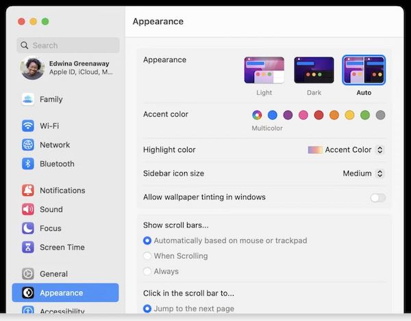
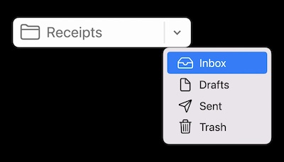
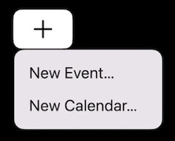
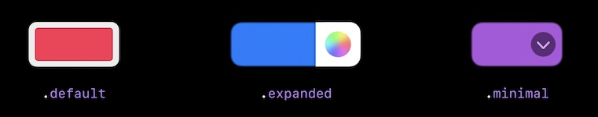
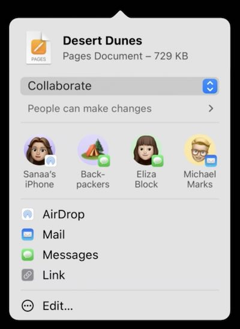

## Stage Manager



* Keeps the workspace tidy
* Cleans up inactive windows in your workspace by showing only the active window
* Active window takes **center stage**
* Pull windows together into sets which swap in and out as a group

IMPACTS on how your windows present themselves

* Newly presented windows *replace those on stage*
* Auxiliary windows cohabitate with primary windows (panels, popovers, settings)

By default: Wont swap out IF you present 

 * floating panels
 * modal window,
 * window with a preference style toolbar

A window's collection behaviour is respected. (`collectionBehavior`)

If a window's collection behavior is 

* `.auxiliary`
* `.moveToActiveSpace`
* `.stationary`
* `.transient`

Wont displace the active window in center stage.

## System Preferences (now 'System Settings')



* refreshed navigation scheme
* aligns with iOS
* Existing custom preference panes need no change.
* Adopt the new styles when you're ready, or not at all.
* New interface style for all configuration options with a new design language. 
* Best way to adopt the new style is with SwiftUI.

### What about AppKit?

* Suggests incremental adoption of SwiftUI into your existing app.
* Note - no indication of how to do this in AppKit directly.
* See ["SwiftUI with AppKit"](https://developer.apple.com/wwdc22/10075) WWDC22

### How?

Create a form, set the formStyle `.grouped` to get the new style

```swift
enum AirDropVisbility: String, CaseIterable, Identifiable {
    case nobody = "No One"
    case contactsOnly = "Contacts Only"
    case everyone = "Everyone"

    var id: String { rawValue }
    var label: String { rawValue }
    var symbolName: String {
        switch self {
        case .nobody: return "person.crop.circle.badge.xmark"
        case .contactsOnly: return "person.2.circle"
        case .everyone: return "person.crop.circle.badge.checkmark"
        }
    }
}

struct ExampleFormView: View {
    @State private var name: String = "Mac Studio"
    @State private var screenSharingEnabled: Bool = true
    @State private var fileSharingEnabled: Bool = false
    @State private var airdropVisibility = AirDropVisbility.contactsOnly

    var body: some View {
        Form {
            TextField("Computer Name", text: $name)
            Toggle("Screen Sharing", isOn: $screenSharingEnabled)
            Toggle("File Sharing", isOn: $fileSharingEnabled)
            Picker("AirDrop", selection: $airdropVisibility) {
                ForEach(AirDropVisbility.allCases) {
                    Label($0.label, systemImage: $0.symbolName)
                        .labelStyle(.titleAndIcon)
                        .tag($0)
                }
            }
        }
        .formStyle(.grouped)
    }
}
```

### In-app 'Preferences' have been renamed to 'Settings'

* When building against macOS 13 SDK AppKit will automatically rename 'Preferences' in App menu to 'Settings'
* You should update your own code to use 'Settings' instead of 'Preferences' wherever else

## Controls

### NSComboButton (new!)

* Immediate button action with a menu containing additional options
* Traditionally created using an NSSegmentedControl.

Two styles :

#### split

separate arrow portion just for the menu



#### unified

Primary action on click, menu action with click and hold.



### NSColorWell



Default color well has new look. No adoption required - will just happen.

Two new styles (along with `default`)

* **`minimal`**: shows a disclosure arrow on rollover - shows popover with palette of colors.
You can customize the popover content (eg. for a different palette, or to display a menu)
* **`expanded`**: color picker like in the iWork apps, with both disclosure arrow and color picker button
You can customize the popover content (eg. for a different palette, or to display a menu)

* These are set using the new property `colorWellStyle`
* New target/action pair for its action. If nil, uses system standard behaviour.

### NSToolBar

* `toolbarImmovableItemIdentifiers` - set toolbar items that _cannot_ be moved or removed by the user
* `canBeInsertedAt` - veto power of any particular reordering, insertion or removal from the toolbar (eg. for example, you could create a toolbar item that's allowed within one section of the toolbar, but it's disallowed within another section.)
* `centeredItemIdentifiers` - multiple centered items for the toolbar. Can only be moved within the center group
* `possibleLabels` - provides a set of labels so NSToolbarItem will size to fit the maximum label length

### NSAlert (with long text)

* Long text alerts will now use a new wider style (reminiscent of older NSAlert layout).
* Also if accessory view for the alert is too big for compact mode.
* Happens automatically when the text is over a certain length. No coding change required.

**Note** Once the alert it displayed changing the text doesn't change the alert size.


### NSTableView

`NSTableView` now lazily calculates the heights of the rows, which significantly improves performance.

No code change will be necessary. This also improves SwiftUI lists on macOS.

`NSTableView` keeps a running estimated height based on previously measured height for rows outside the viewport

NOTE: If your code previously assumes a particular ordering of delegate calls like `heightOfRow:` then you'll need to refactor your code as the delegate calling order is now different.

## SF Symbols

* 450 new symbols

Rendering modes :-

* monochrome
* hierarchical (differing opacities of the same color)
* palette (allow specifying distinct colors)
* multicolor (built in to the symbol)

#### Preferred rendering mode

Symbols can specify the style of rendering that they prefer, and at runtime AppKit will use that style automatically

#### Variable symbol

Some symbols don't just represent a concept, they're also meant to communicate some value or quantity, like your Wi-Fi signal strength, or audio volume

* Floating point value between 0 and 1
* If symbol doesn't support setting a value, value is ignored.

```
class NSImage {
   public init?(symbolName: String, variableValue: Double, accessibilityDescription: String?)
   public init?(systemSymbolName: String, variableValue: Double, accessibilityDescription: String?)
}
```

## Sharing



### New style

Same APIs and delegate methods as the previous picker.

* Suggested People
* Invite and manage people youre collaborating with

`NSSharingServicePicker` can now create a `standardShareMenuItem` for you to put into your own menu or button instead of having to create one yourself.

### `NSPreviewRepresentableActivityItem` protocol

Conforming your share item to `NSPreviewRepresentableActivityItem` will allow you to provide a title, image, metadata to display at the top of the sharing panel

### `NSPreviewRepresentingActivityItem` class

A convenience class for bundling an existing sharing item with its metadata. Images can be NSImage or NSItemProvider.
