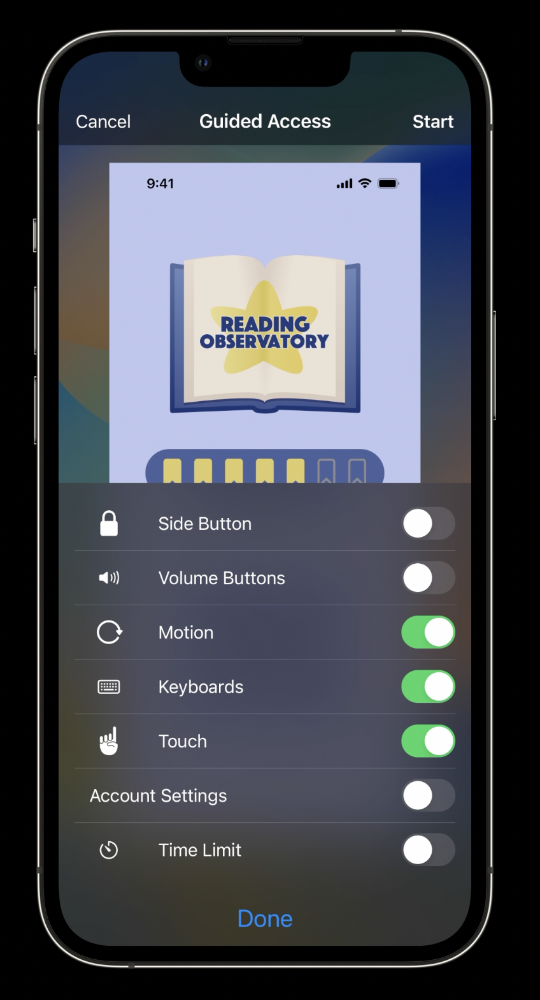
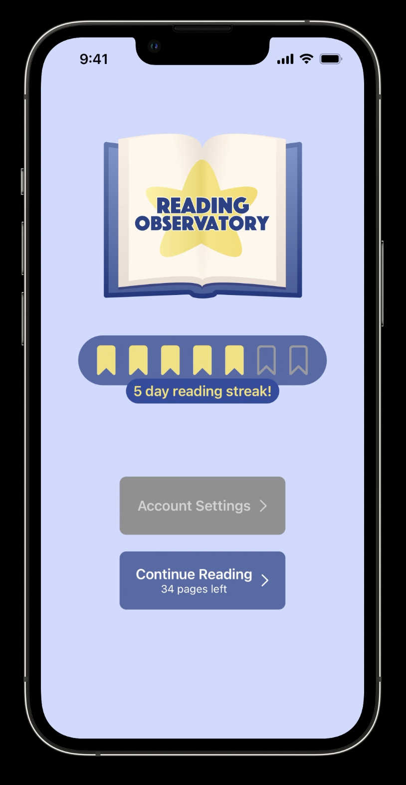
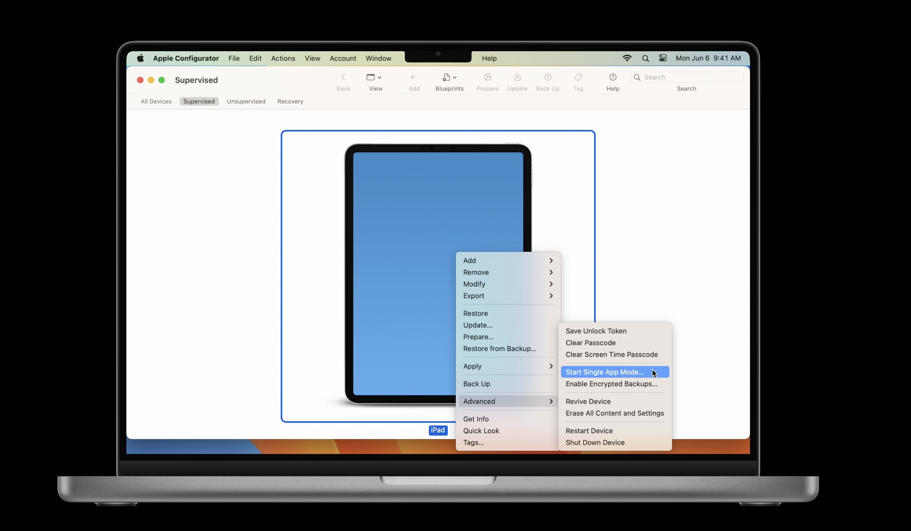

## What is a Single App Mode (SAM)?

- Restrict certain behaviors on iOS / iPadOS
- Lock device to single app
- Initiated by system or app
	- Allow control of timing between restricted and unrestricted state
	-  Can also apply restrictions on top of single app mode (such as enabling/disabling auto-lock)

### When do you use a Single App Mode?

3 examples when you'd want a device in SAM:
- iPad used to place food orders at an event
- Device used in medical setting where patients are passed device from staff to fill out info
- Device used in school environment for students taking tests

Another use case: Guided Access. Any user can put any app in Single App Mode

## Guided Access

Allows device user to put any app in Single App Mode, i.e. is user-initiated.

### How to turn on/off

- Go to Settings -> Accessibility -> Guided Access and enable the setting
- Open app you want to lock
- Use Accessibility Shortcut to enable (i.e. triple-click the side or home button of device)
- Configure system restrictions in workspace that pops up
	- Can restrict touch interaction, display motion, software keyboard
	- Can restrict hardware button events: volume buttons, sleep/wake button

### Developer considerations

#### UIAccessibility API Custom Restrictions 

- Tailor experience in GAX by restriction parts of your app's functionality
- Accommodate those with cognitive or learning disabilities, who might need a different experience within your app

#### Design principles for cognitive AX

- Be forgiving of errors and mitigate them before they happen
- Warm users before performing irreversible actions (like deleting a thread)
- Reduce dependence on timing; using timed alerts, automatically performing an action after a timeout are an anti-pattern to avoid
- Always confirm payments

Doing the above promotes user independence in your app!

#### Demo App

A custom restriction to disable the Account Settings button in the app when in Guided Access. The restriction lives in the same overlay as the system restrictions when Guided Access is enabled.

|  |  |

Notice now the Account Settings button is disabled.

```swift
class AppDelegate: NSObject, UlApplicationDelegate,
UIGuidedAccessRestrictionDelegate {

	// Each restriction needs an identifier

	var guidedAccessRestrictionIdentifiers: [String]? {
		return ["com.reading-observatory.account-settings-restriction"]
	}

	// Each restriction needs a user-facing title and an optional description

	func textForGuidedAccessRestriction(withIdentifier restrictionIdentifier: String) -> String? {
		return "Account Settings"
	}

	func detailTextForGuidedAccessRestriction(withIdentifierrestrictionIdentifier:String) -> String? {
		return "Restrict account settings access"
	}

	// Post a local notification when Guided Access restrictions change in order to update relevant UI

	func guidedAccessRestriction(withIdentifier restrictionIdentifier: String, didChange
newRestrictionState:UIAccessibility.GuidedAccessRestrictionState) {

		let notification = Notification (name: Notification.Name(rawValue:
"GuidedAccessRestrictionDidChangeNotification"))
		NotificationCenter.default.post (notification)
	}
}
```

## Single App Modes

- All other SAMs enter SAM programmatically, *not* initiated by the user like Guided Access.
- Prevent users from swiping home, modifying settings, looking things up in safari etc.

### (Basic) Single App Mode

- Good when you want to stay in single app forever on this device, i.e. kiosk food ordering scenario
- Stay locked in app *even after* reboot
- No manual intervention for upkeep of this mode
- Device *must* be supervised via Apple Configurator (or other device management software)
	- This software can put many devices in SAM at one time
	- In Apple Configurator: select a device -> Advanced -> Start Single App Mode -> Select App to lock into



### Autonomous Single App Mode (ASAM)

- Good when restricted state needs to be entered and exited, i.e. medical scenario where we'd enter this mode when passing device to patient and exit when they return it to us
- App makes API method call to get in and out of Single App Mode
- Must ALSO be supervised via Apple Configurator (or other device management software)
- App must *also* be allow-listed for ASAM in device's configuration profile

```swift
// Use this API to enter/exit ASAM mode manually

UIAccessibility.requestGuidedAccessSession(enabled: true)
```

Notice with the above API: Guided Access is the foundation for all single app modes. Below is an example in practice:

```swift
// Enter and exit Autonomous Single App Mode

func beginAutonomousSingleAppMode() { 
	UIAccessibility.requestGuidedAccessSession(enabled: true) { succeeded in
		guard succeeded else {
			/* handle failure case */
			return
		}
		requestNewPatientSheet()
	}
}

func endAutonomousSingleAppMode() {
	UIAccessibility.requestGuidedAccessSession(enabled:false) { succeeded in
		guard succeeded else {
			/* handle failure case */
			return
		}
		submitNewPatientSheet()
	}
}
```

- On failure, we might want to alert user in completion handler that we failed to lock down the app so they don't hand the device to the patient
- Status change callbacks can invoke behaviors as you enter/exit ASAM mode
- Reminder! entering ASAM will fail without app bundle ID in Device Config file like this:

```xml
<key>PayloadContent</key>
<array>
	<dict>
		<key>AllowedApplications</key>
		<array>
			<dict>
				<key>BundleIdentifier</kev>
				<string>com.apple.safari</string>
				<key>TeamIdentifier</key>
				<string>team-id</string>
			</dict>
		</array>
	</dict>
</array>
```

### Assessment Mode

- Restrict certain features like spell check during testing to avoid unfair advantages
- Test takers also cannot access outside notes/resources, etc.
- Unified API macOS / iOS
- Does *not* require supervision (i.e. Apple Configurator)
- *But* must apply to Apple for an assessment entitlement
	- Check out [What's new in assessment](https://developer.apple.com/videos/play/wwdc2020/10005/) for more info

## Accessibility API

- People using assistive technologies like VoiceOver or Switch Control may also use apps in Single App Modes
- Example: someone who is blind comes to order food on your kiosk app. How do they turn on VoiceOver?
- Apple Configurator and other device management software let you configure accessibility options for SAMs
- Accessibility shortcut is configurable to show a subset of iOS accessibility features
- Some accessibility features can also be set to always enabled
- This enables people who rely on these technologies to continue using them on them while using your app
- These options must be configured *before* entering a SAM
- You can also toggle features directly with code (i.e. while in a SAM)
	- Good for kiosk enclosure where hardware buttons are blocked, so Accessibility Shortcut is not available
	- API for turning off/on certain Accessibility features: Zoom , VO, Invert Colors, AST, Gray-scale

```swift
UIAccessibility.configureForGuidedAccess(features: .voiceOver, enabled: true)
```

It's import to always consider the experiences of someone with a disability when using your app in a SAM!

