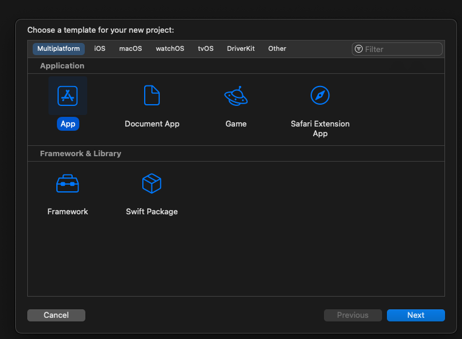
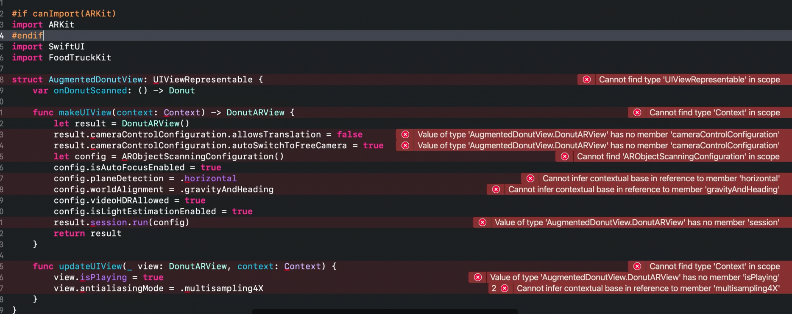
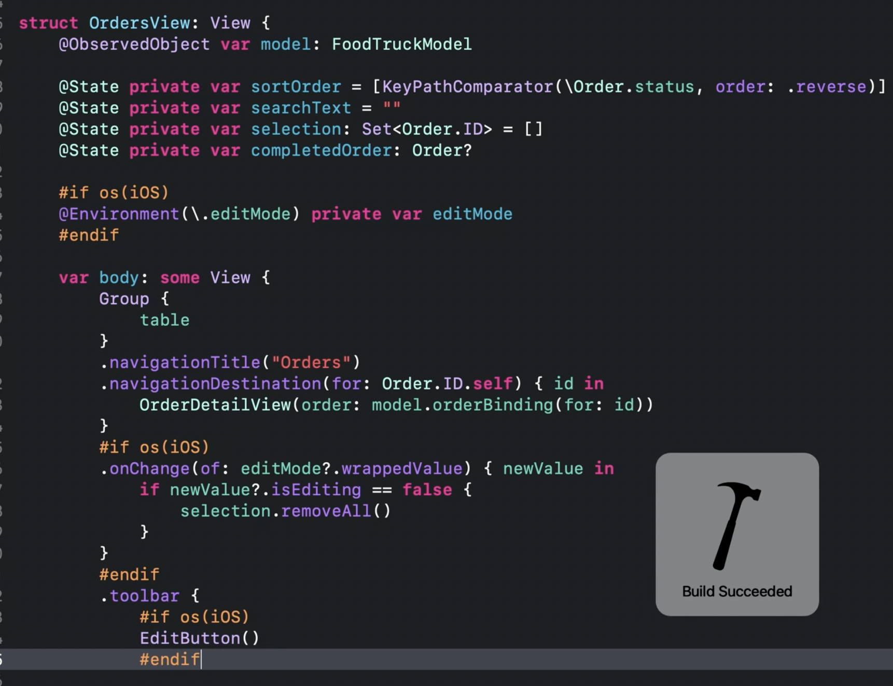
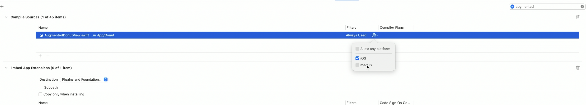

- Use Xcode to develop a multi platform app

## Preview canvas

XCode 14.support multiple platform, Single App Target can support even more destinations across multiple platforms, all while maintaining a single common code,
share the settings by default.

- 

## What is multipleplatform target is and which cases are the Best?

### Best Case to use multiple Targets

Prior to XCode 14 in order to build application that support macOS and iOS you need two different targets. This is still great for the following cases:
 1. Potentially different codebase.
 2. Share few settings between different platforms.
 3. Customization for each destinations or underlying technologies are different for each platform.

### Single App Target

From XCode 14 single app target supports many destinations like iPhone, iPad, Mac and Apple TV 💪. Allowing you to use common codebase and share most of settings
across destinations but still allows **customization when needed**.

## How to create a Multiplatform Project

### Starting a new Project
You can use multi platform project by choosing XCode Template from File name.
File -> New -> Project -> Select Multiplatform -> App



Multiplatform template uses SwiftUI for its lifecycle and interface and pre-configure with iPhone, iPad and macOS provides you to the great way of start.
SwiftUI enable to access the full feature set of each SDK.


### Integrate App Target to existing App
Open Project setting and add the Mac Target


### When to Chose Mac Catalyst

App relies heavily on UIKit and Storyboards choosing Mac Catalyst allows you to convert your existing iPad application to a Mac app.

### When to Chose Mac

Incase your application already using Swift UI Mac is best option.

IMPORTANT:
- On selecting the open XCode will automatically change the project configuration but it will change the source code developers needs to resolve by themselves.
- It's totally valid if you can multiple Mac Destination in you application. This allows if we are migration from Mac Catalyst to Mac app.

You are allow to create different configurations example Debug, Release Beta for each of the destination.

### Capability & Entitlements
- Capability and entitlements are share between the platform. Consider an if the user purchase an item from Mac app they don't need to purchase for iOS or iPad  app.

## Resolve Build Issue 😉

Depending on the destination some API will not be available, you need to resolve it by yourself as XCode automatically won't do it for you, Similar case when with @available flag.

1. Resolve via `canImport` flag
Let's consider the following example where we are using `ARKit` framework in iOS and which is not available for macOS,  we need to resolve it via `canImport` condition.

```
#if canImport(ARKit)
import Foo
#endif
```



2. Resolve via `os` flag


Now let's suppose certain api is only available in iOS but not an mac os 

```
#if os(iOS)
@Environment (.\fooKey) private var foo // Note @Environment is only available in iOS
#endif
```


3. Resolve via specifying Target

Using complier flag will comes with hassle you need to wrap the code as well it far better to only build the file for specific target.

You can navigate to the project Settings
Select Build Phase -> Compile Source -> Exclude Target by unchecking it.



## Customize experience for specific platforms 

One this that you need to consider via building multiplatform that your image size shouldn't be hard corded because using point size will not work properly across platforms, it this manner it's better to use Design Tokens or `#if os(iOS)` or `#if os(macOS)` as follows:

Consider we have thumbnail size that will be different in macOS and iOS versions.

```
var thumbnailSize: Float {
#if os(iOS)
    return 120
#else 
    return 20
#endif
}

```

### Platform experience

- Utilize Platform features
- Refine choices for new expectations
- Follow SwiftUI Best practices
- Human interface guidelines

## Publish Changes 🚀

Single app target does indicate that we have single product. Each product should archive by specifying the target sdk.

