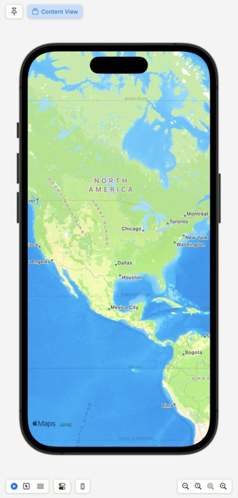

In this session I will build a fully functional trip planner from scratch.  
- I will use annotations to mark places on the map. 
- Enable selection so that I can tap on each marker to learn more about that place.
![annotations][annotations]

[annotations]: ../../../images/notes/wwdc23/10043/annotations.jpg
 
- Integrate `Look Around` to explore some places we might want to visit.
![look around][look around]

[look around]: ../../../images/notes/wwdc23/10043/lookAround.jpg 

- Add an overlay that shows a driving route to the beach. 
![overlay][overlay]

[overlay]: ../../../images/notes/wwdc23/10043/overlay.jpg 

- Use the map to display different locations and regions.
![Enabling Regions][enablingRegions]
![Enabling Regions][enablingRegions2]
- Add another dimension to the map by enabling realistic elevation. 
![Enabling Realistic Elevetion][enablingRealisticElevetion]

[enablingRealisticElevetion]: ../../../images/notes/wwdc23/10043/enablingRealisticElevetion.jpg 

- Show how to display satellite and flyover imagery as well. 
- Add some controls to the map, including a user location button, so that I can figure out where I am.
![User Location Buttons][userLocationButtons]

[userLocationButtons]: ../../../images/notes/wwdc23/10043/userLocationButtons.jpg 
Let's start with a brand-new SwiftUI project in Xcode. 

I remove the boilerplate code, add `import MapKit` and `Map()` to the `ContentView()` and this alone is already enough to show the map in the preview.


```Swift
import SwiftUI
import MapKit

struct ContentView: View {
    var body: some View {
        Map ()
    }
}
```
<!---->

Nice! I have an interactive map with just one line of code! 
I like the parking garage right underneath the Common. The first thing I’ll do is add some content to the map to mark the parking garage.  
![The first marker][marker]

[marker]: ../../../images/notes/wwdc23/10043/marker.jpg 


I’ll use a MapContentBuilder closure to add a marker to the map. 
 ```swift
extension CLLocationCoordinate2D {
    static let parking = CLLocationCoordinate2D(
        latitude: 42.354528, longitude: -71.068369
    )
}
```
and
```Swift
import SwiftUI
import MapKit

struct ContentView: View {
    var body: some View {
        Map () {
            Marker("Parking", coordinate: .parking)
        }
    }
}
``` 
Adding a Marker to the map is a lot like adding a View to a List. 
The map has automatically framed our content by zooming in to show the Marker.
Markers are used to display content at a specific coordinate on the map. The balloon shape might look familiar to you. You’ll find Markers used in the Maps app and across the platform, including in a wide variety of apps you can find on the App Store.  
```swift
Map {
    Marker ("Sign-in", systemImage: "figure.wave", coordinate: signIn)
}
``` 
![Another marker example][marker2]

[marker2]: ../../../images/notes/wwdc23/10043/marker2.jpg 
Like Marker, Annotation is used to display content at a specific coordinate. 
```swift
    Annotation (
        "Sign-in", coordinate: signIn, anchor: bottom
    ) {
        Image (systemName: "figure.wave")
            .padding (4)
            .foregroundStyle(.white)
            .background (Color.indigo)
            .cornerRadius (4)
    }
```
![Another annotation example][annotations2]

[annotations2]: ../../../images/notes/wwdc23/10043/annotations2.jpg
 

Instead of Marker’s balloon, Annotation displays a SwiftUI View. 
The content builder can be used to present overlay content as well. You can use the content builder closure to add all kinds of content to the map. 
```swift
        MapCircle (center: islandCenter, radius: islandRadius)
            .foregroundStyle(.orange.opacity(0.75))
        
        MapPolyline (coordinates: sidewalk)
            .stroke(.blue, linewidth: 13)
            
        MapPolygon (coordinates: dock)
            .foregroundStyle(.purple)
```
![Other content example][otherContent]

[otherContent]: ../../../images/notes/wwdc23/10043/otherContent.jpg

I want to display a custom SwiftUI view for the parking spot, so I’ll use an Annotation to mark it. Here, I’m using ZStack to compose some shapes and an image. This SwiftUI view will be displayed on the map centered right on the parking coordinate. If you’d like your view to be positioned above the coordinate instead, you can use Annotation’s anchor parameter. Specifying an anchor value of “bottom” will position the bottom of your view right on the annotation’s coordinate. 
I’ve used a MapContentBuilder to display annotation content on the map. 
I’d like this app to convey a sense of place as I’m looking at the map. 
```Swift
struct ContentView: View {
    var body: some View {
        Map () {
            Annotation("Parking", coordinate: .parking) {
                ZStack {
                    RoundedRectangle(cornerRadius: 5)
                        .fill(.background)
                    RoundedRectangle(cornerRadius: 5)
                        .stroke(.secondary, lineWidth: 5)
                    Image(systemName: "car")
                        .padding(5)
                }
            }
            .annotationTitles(.hidden) // hide the title, icon only
        }
    }
}
``` 


I’ll use mapStyle to achieve that by enabling realistic terrain elevation. 

You can set a style using the mapStyle modifier.

This is the standard map style. By default, it offers a flat presentation much like a physical paper map.  It looks like there’s a bridge across the lagoon, so you can walk from one side to the other. This flat map really leaves something to the imagination, though. I’ll enable realistic elevated terrain to give the map another dimension to work with.  Enabling realistic elevation really brings the map to life. Looking at the lagoon now, I can imagine taking a ride on one of the swan boats that cruise around in the summer and picture the boat passing under the bridge. Using the imagery map style is another great way to offer your users a sense of place. The imagery map style displays a map rendered using satellite or flyover imagery. The Hybrid map style combines imagery with roads and labels. To recap, I’ve enabled realistic elevation using the standard mapStyle and I’ve shown you how to use some other map styles as well. Next, I’d like the app to help us search for the places we want to visit. Our kids will be with us walking around Boston, and I want our morning to be fun for them, too. The grown-ups can appreciate seeing some history while the kids can appreciate swings and slides and monkey bars! I’ll add a button to search for playgrounds, and a button to search for beaches, too. The app will add a Marker for each search result. You’ll learn a little bit more about Markers and you’ll also learn how to show your own UI above the map without getting in the way of the search results. Earlier today, I made a little BeantownButtons View. Tapping a button calls a search function with a simple query, either playground or beach. The search function uses MKLocalSearch to find places near the Boston Common parking garage, and writes the results using a binding.

Back in the app’s main ContentView, I’ll add State to keep track of the search results. When the BeantownButtons UI performs a search, it will write the results back to this state using a binding.  I’ll add the buttons above the map at the bottom of the screen. Using safeAreaInset will make sure the app’s UI doesn’t obscure any of the content I’m adding or any system-provided controls that can appear on the map, such as the Apple Maps logo and Legal link. Next, I’ll use the content builder to add search result Markers. I'm using ForEach to add a marker for each search result.

I’ll try these buttons out. Let’s find some playgrounds. Look! Playgrounds! The map has automatically framed them by zooming out so that all of them are visible. How ‘bout some beaches? The search results are MKMapItems, which is the type MapKit APIs like MKLocalSearch use to represent places. Here, I’m using Marker’s map item initializer. Markers created this way use the map item’s name for their title and use information from the map item to show an icon and tint color that represent the place. Most of these search results show as light blue beach umbrella markers. When you’re working with map items, Marker’s automatic content and style support is very convenient. Even if you aren’t using map items, though, you still have control over the Marker’s presentation. By default, Marker shows a map pin icon in its balloon, like you see here. You can provide your own icon using an Image asset or a system image. You can also show up to three letters of text using monogram. You can change the Marker’s color using the tint modifier. To recap, I’ve used safeAreaInset to display some buttons above the map while making sure they don’t obscure the search result markers. Next, I’m going to put the app in control of what’s displayed by the map. I’ve been adding content to the map. Each time I have, the map has automatically framed my content for me. I’ll show you how to enable this convenient behavior when you need it. I’ll also show you how to display something else entirely, like the Boston area’s North Shore coastline. Right now, we’re looking at beaches.

If I pan away and search for playgrounds... the map no longer automatically displays the results near our Boston Common parking spot. To display the search results after the user has interacted with the map, I’ll need to re-set the Map’s camera position state so that the map will frame the markers...

so, I’ll add state to track the position. I’ll use the default automatic position that frames the content we’ve added to the map.

And I’ll pass the binding to Map’s initializer.  I’ll use an onChange modifier to find out when the search results are updated. When they are, I’ll simply set the camera position back to automatic to make sure they’re visible.

Let’s give it a try. I’ll search for beaches, see the results... and then pan away before searching for playgrounds.

Cool! Now when I perform a search, the results are all displayed even if I had panned all the way to Rhode Island. There’s another thing I’d like to do using this position state. After a fun morning in Boston, my family will be driving North to spend the afternoon at the beach. I’d like the app to make it easy to see the North shore coastline so we can get a feel for where we’ll be going. I’ll use the position state to do that.

I’ll add coordinate regions for the city and for the North Shore. I’ll switch over to the BeantownButtons UI and I’ll add a binding for our position state.

I’ll add a couple of buttons, each setting the camera position to a region.

When I press the City button, the Map will show Boston. When I press the Waves button, the map will show the north shore coastline.

I’ll switch back to ContentView and pass a position binding to the buttons UI.   Let’s give it a try! When I tapped the “waves” button, the map’s position was updated to show the north shore coastline region. When I tap the “city” button, it’s updated to show Boston. Behind the scenes, what the Map shows is ultimately controlled by a MapCamera. The camera looks at a coordinate on the ground from a certain distance and the orientation of the camera determines what is visible in the map. The app I’m building has not had to create or configure the camera itself. Instead, it simply specifies what should be in view using MapCameraPosition. MapKit takes care of the camera for me. The app uses an automatic camera position to frame content, such as search results. It uses a region position to show Boston and the North Shore. You can specify a camera position to frame other things, as well. Rect position is used to show an area, just like how we’ve used region. It simply uses a map rect to represent that area, instead of a coordinate region. Let’s take a closer look at item, camera, and user location camera positions.

Using MKMapItem, you can show a particular place. This works for all kinds of map items. If your map item represents Cape Cod Bay, MapKit will automatically zoom out so that it fits. If you’re trying to show a certain park in the North End, the camera will zoom in to show the surroundings and deliver a sense of place. You can also simply supply a MapCamera, configured exactly the way you want it. Using a MapCamera with a pitch angle is a great way to deliver a 3D perspective. Or, perhaps you’d like the camera to follow the user’s location as they’re walking along the Charles River. You can supply a fallback position that will be used when the user’s location is not known, such as when location authorization has not been granted or while the device is trying to get a location fix. If you provide a binding to your camera position state, MapKit will update it when the camera position changes. Here is a user location camera position. The followsUserLocation property is true. If the user pans away, the camera is no longer following the user’s location. When the user interacts with the map, the camera position state is positionedByUser. If the app sets the camera position state back to userLocation, the camera follows the user’s location. When your app sets the camera position state, it is not positionedByUser. The user can position the camera by interacting with the map no matter which type of camera position you specify. All right! The app is now in control of what’s in view on the map. I’ve used the automatic camera position to ensure the search results are visible even after the user has interacted with the map. I’ve used the region camera position to display Boston and the North Shore. Next up, instead of only searching near Boston Common, I’d like to pan the map to an area I’m interested in visiting and search there instead. I’ll show you how to get the visible region when the camera changes. I’ll add state to track the region that’s visible in the map. I’ll add an onMapCameraChange modifier, where I’ll grab the visible region from the update context and stash it in my own state. By default, the closure supplied to onMapCameraChange will be called when the user has finished interacting with the map. To have the closure called while the user is interacting with the map, you can request continuous updates by passing a frequency parameter. In addition to the region property that I’m using here, the context also has a property for the visible map rect and one for the map camera itself. Depending on my needs, I could use those as well. I’ll update BeantownButtons so that it will search within the region that’s visible to the user. I’ll add the visibleRegion to the buttons.

And I’ll use it in the search request. In ContentView, I’ll pass the visibleRegion to the buttons UI.

Let’s search for North Shore beaches! There’s the North Shore. Show me some beaches! Sweet! How about Rhode Island? Cool! Now I can search for beaches in Rhode Island, too! I’ve enabled this using onMapCameraChange, which informs us when there’s been a change in what’s visible. Next, I’d like the app to make it a little easier to pick which beach we’ll be going to. There sure are a lot to choose from. To get started, I’ll add support for selecting a search result. Right now, if I tap on a search result marker, nothing will happen. There is no selection state, so the markers are not selectable.  To enable selection, I’ll just add a selection binding to our Map.

Now let’s see what happens when I tap on a result.

The balloon animates to show that it’s selected! I’m using MKMapItem as the selection type, so each marker that represents a map item is now selectable. The Parking Spot annotation doesn’t represent a map item, so it is not selectable. If you want to support selection for Markers and Annotations that don’t necessarily have the same type of identity, you can simply tag them. This works the same way it does when managing selection with Picker and List. Here, the selectedTag state is an Int. Each marker is tagged with an Int, so the binding enables selection for both of them. When using tag to enable selection, you can use any type conforming to hashable for your selection state. To recap, I’ve added an MKMapItem selection binding to Map, enabling selection for the search result markers. Next, the app should display some additional information about the selected search result. I’ll add a look around preview to offer a sneak peek at the beach, and I’ll add the name of the beach and the drive time as well. Earlier today, when I was writing the BeantownButtons View, I also wrote a little ItemInfoView that shows... a title, the estimated travel time, and a Look Around Preview. The Look Around Preview will show me what the selected beach looks like. The Preview displays a Look Around Scene. You can get the scene for a given map item using MKLookAroundSceneRequest. The scene will be fetched when the view is displayed, and again any time the selected search result changes. Finally, there’s a property that formats an MKRoute’s expected travel time for display, using DateComponentsFormatter. I’ll switch back to ContentView and add this ItemInfoView. First things first: I’ll get a route from the parking garage to the selected search result. I’ll add state to keep track of a route... and I’ll add a function that uses MKDirections to get one... and set the state.

I’ll add another onChange modifier to call the function when the selection changes.  The app will show our item info view when it has a selected search result.

While I’m at it, I’ll hide the Marker titles for the search results to clean up the appearance of the map just a bit. The ItemInfoView will display the name of the selected place instead. Okay! Let’s see what we got.

Ya know, I heard there was a playground near this one… It looks pretty nice.

I wonder what’s over this way?  Nice! A beach with a playground, right there? For our family, that’s gonna be pretty tough to beat. It’s about half an hour from Boston Common. Seems like a great spot. To recap, I’ve added a look around preview that will be displayed when a marker is selected. Along with the estimated travel time from MKRoute, this will really help us pick a beach. Next, since we already have a route to show the travel time, we should totally use it to display the driving route from Boston Common to the selected search result. I’ll add a MapPolyline overlay to show the route, and I’ll show you some other types of overlay content you can add as well. When a route is available, I’ll add a MapPolyline, and stroke it with blue. Let’s see it on the map.

 Looks like a pretty nice drive! It was pretty easy to use MapPolyline with MKRoute. You can also use MapPolyline to show your own location data. You can use StrokeStyle to deliver some pretty fancy stuff, such as dashes and a gradient. If you’re looking to highlight an area, you’ll want to use MapPolygon or MapCircle. Here are two polygons that mark a couple of parks. Here are two circles marking the same parks. You’ll notice that an overlay level is specified for each circle. The pink circle is using the default overlay level of above roads, which puts the map’s labels above the circle. The cyan circle is using above labels. The app is really taking shape. I’ve added a MapPolyline to show the driving route to the beach, and I’ve shown you a couple of other overlay types that you can use as well. Next up, I want the app to make it really easy to figure out where I am. When we get to Boston and start walking around, it’s possible, maybe even likely, that we’ll get just a little bit lost. I’ll add UserAnnotation as content to show where I am, and I’ll add a MapUserLocationButton to find myself. You’ll learn about several other types of map controls that are available to use as well. So when I’m trying to find myself, I usually start by looking for the little blue dot on the map. I’ve added UserAnnotation to my map content, so now my location appears on the map. Where am I?  There I am! It looks like I’m really quite far away from those playgrounds and beaches we’ve been checking out.

I sure had to zoom out and pan a lot to get over to Apple Park. MapUserLocationButton will sure make that easier.

Now, I can tap the button to display my location. The map camera will follow me as I move around. I’ve also added a MapCompass and a MapScaleView.

The default mapControls configuration shows a compass when the map is rotated, and a scale indicator while the user is zooming in or out. I want these default controls in this app too, so I’ve specified them in addition to the user location button. I’ve added all of these using the mapControls modifier, so the map will automatically display them in their default locations. This includes map controls on all platforms, including the MapZoomStepper and MapPitchSlider that you’ll find on macOS. If you’d prefer to position these controls yourself, you can present them in your own UI. The Map controls are simply views, so instead of using the mapControls modifier, you can just add them as you would any other view. When you do this, you will need to use the mapScope modifier to associate your controls with a particular Map scope. We’re almost at the end of our presentation, so let’s summarize what we've learned today. MapKit for SwiftUI is an incredibly powerful, easy-to-use API to integrate Maps into your app. It allows you to use Markers, Annotations, and Overlays to show your content on a map. Map Camera and Map Controls allow you to tailor the map to your needs. Finally, MapStyle and Look Around give your users a real sense of place. These are just some of the features of MapKit for SwiftUI, so make sure to check out the Developer Documentation to learn more. And of course, because this is SwiftUI, your map will look great on all platforms! A few final thoughts as we wrap up. We’ve extended our Apple Maps Server APIs to support Autocomplete and Directions. To learn more about how to use our Server APIs, check out last year’s dub-dub session “Meet Apple Maps Server APIs.” As always, we’d love to hear your feedback! Please use the Feedback Assistant to let us hear your thoughts. Last, but not least, I encourage you to check out the new features in SwiftUI this year. Animation plans are a great way to add animations to your map! Check them out in the session below. That’s it! Thanks so much for watching! I’ll see ya at the beach! ♪ ♪


## Check out also 
SwiftUI Animation Plans WWDC23
Meet Apple Maps Server APIs WWDC22


![I am a description for the image.][reference-name]


[enablingRegions]: ../../../images/notes/wwdc23/10043/enablingRegions.jpg 
[enablingRegions2]: ../../../images/notes/wwdc23/10043/enablingRegions2.jpg 
```Swift

```
```Swift
```
```Swift
```
```Swift
```
```Swift
```
```Swift
```
```Swift
```
```Swift
```
```Swift
```
```Swift
```
```Swift
```
```Swift
```
