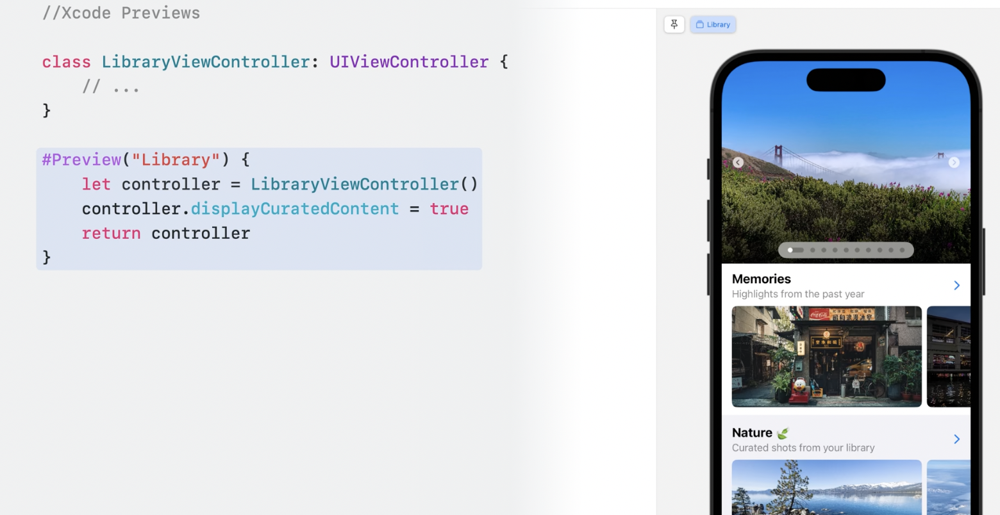
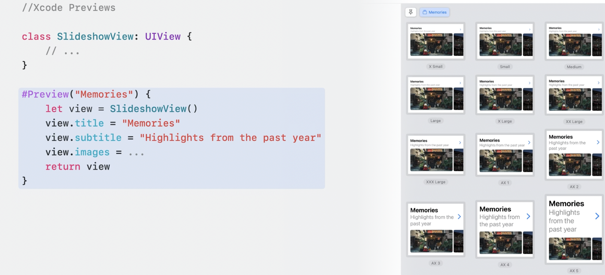
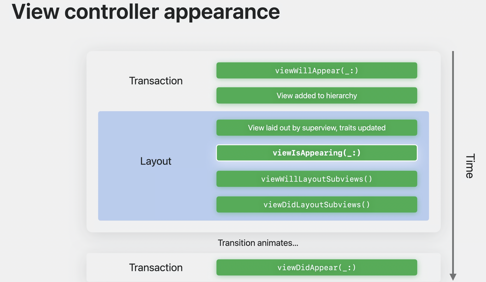
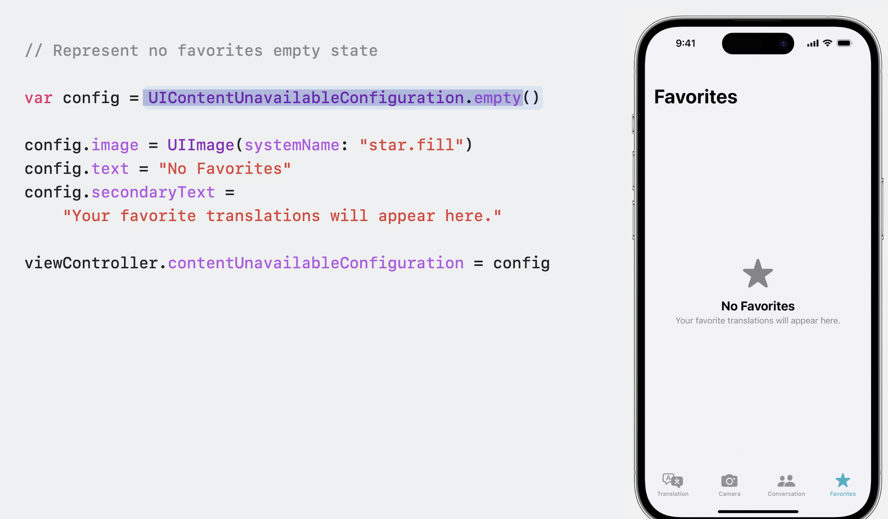
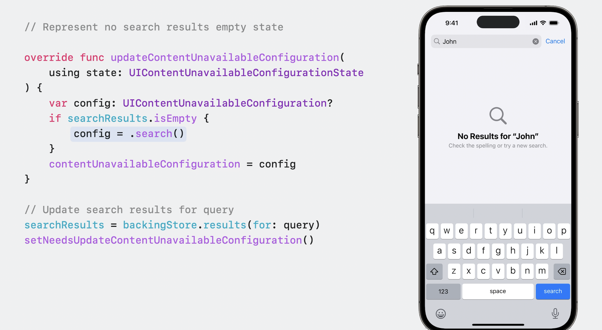
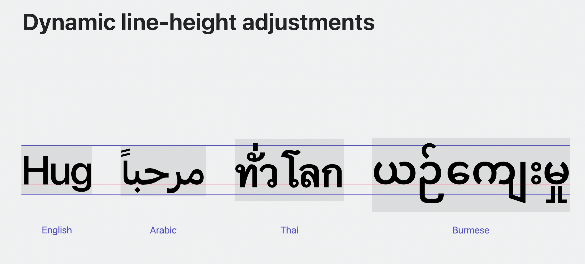
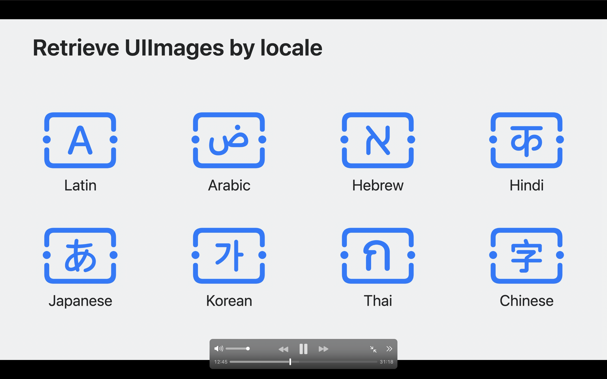
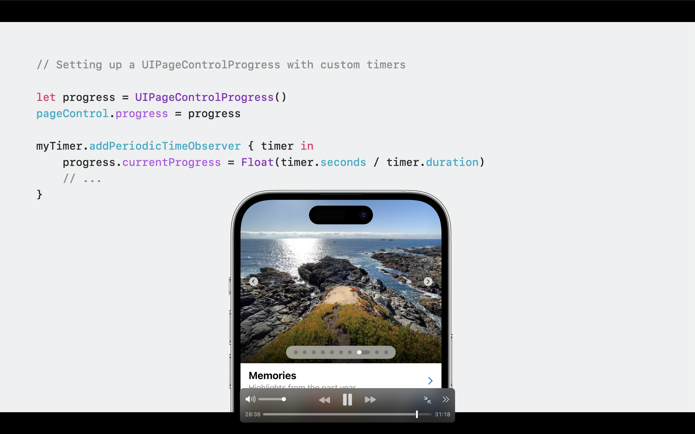

## What's new in UIKit

### Preview in for UIKit 🆕
`#Preview` macro allows you to generate a preview for UIViewController and UIView

```swift
class LibraryViewController: UIViewController {
    // ...
}

#Preview("Library") {
    let controller = LibraryViewController()
    controller.displayCuratedContent = true
    return controller
}
```


```swift
class SlideshowView: UIView {
    // ...
}


#Preview("Memories") { // You can also specify name of preview here `Memories` will appear as a tab
    let view = SlideshowView()
    view.title = "Memories"
    view.subtitle = "Highlights from the past year"
    view.images = ...
    return view
}
```



### `viewIsAppearing` life cycle Event 🆕

- Calls between `viewWillAppear` and `viewDidAppear` methods.
- `viewIsAppearing` calls once per during the appearance transition. It's not called too early, or too late, or too often. It is just right. 
`viewIsAppearing` is backwards compatible and allows you available from iOS 13 🎉.
- Best to update UI when view appears 
1. View Controller and view trait collection updated.
2. View added to hierarchy, has accurate geometry.




### Trait System enhancements 🆕
The trait system in UIKit has been upgraded in iOS 17. Traits automatically propagate data through your app's hierarchy. UITraitCollection contains many system traits, such as user interface style, horizontal and vertical size classes, and preferred content size category.

iOS 17 allows you write custom traits, open a new door. You can also adopt more flexible APIs to receive callbacks when traits change value, instead of needing to override traitCollectionDidChange in a subclass.

You can bridge custom UIKit traits with custom SwiftUI environment keys to seamlessly pass data between UIKit and SwiftUI components in your app.

### Animate symbol images 🆕
- New universal animations for all symbols.
- Unified API across UI frameworks.
- Composite layer annotations for custom symbols.

```swift
// Adding simple effects

// Bounce the symbol once
imageView.addSymbolEffect(.bounce)
```

```swift
// Adding simple effects

// Bounce the symbol once
imageView.addSymbolEffect(.bounce)
```

```
// Adding content transition effects
// Change the image, using Replace effect 

imageView.setSymbolImage (pauseImage, contentTransition: •replace.offUp)
```

### Setting up UIContentUnavailableConfiguration 🆕
Allow us to set empty state of view controllers. You can use `UIHostingConfiguration` to use the SwiftUI 🤩 by using `updateContentUnavailableConfiguration`. Whenever the availability of content in your view controller changes, call `setNeedsUpdateContentUnavailableConfiguration()` to request an update. 

|   UIContentUnavailableConfiguration Empty State   | UIContentUnavailableConfiguration Search | UIContentUnavailableConfiguration Update view |
| ----------- | ----------- | ----------- |
|       |       |  |

### Dynamic line-height adjustments 🆕

Font metrics encompass various terms that define the characteristics of a typeface. The baseline serves as an imaginary reference line upon which letters or words rest, while the line-height denotes the vertical spacing between these baselines. The x-height, on the other hand, represents a line that sits atop lowercase letters.

Certain fonts may include ascenders and descenders that extend beyond these standard lines. Ascenders refer to the portions of a font that rise above the x-height, while descenders hang below the baseline. In languages like Arabic, Hindi, and Thai, these elements often require more vertical space compared to Latin letters, which can potentially lead to issues like collisions or clipping.

To mitigate the problem of overlapping ascenders and descenders in all languages, we have introduced a dynamic line-height adjustment feature. This functionality ensures that text elements, such as UILabels, automatically adapt their line-heights and vertical dimensions for optimal legibility. Additionally, iOS 17 have made significant enhancements to line-breaking behavior for languages such as Chinese, German, Japanese, and Korean.

These improvements apply distinct rules depending on the specific text style being utilized.



### Retrieve UIImages by locale 🆕
In iOS 17, applications have the capability to request specific variants by supplying a Locale within the image's configuration. For instance, you can provide a configuration with a Japanese locale to obtain the Japanese version of a symbol. With these enhancements in text rendering and expanded support for various locales, your applications can create a sense of familiarity and belonging for users worldwide.

```swift 
// Retrieve UIImage by locale
let locale = Locale (languageCode: •japanese)

imageView.image = UIImage (
systemName: "character.textbox",
withConfiguration: UIImage. SymbolConfiguration(locale: locale)
)
```



### Page Control Improvement 🆕

UIPageControlTimerProgress has a built-in timer to make it easy to configure each page's duration.
UIPageControl will automatically change its page when the timer duration is met.
For pages that need to follow video players or external timers, which have their own source of truth, use the base UIPageControlProgress type to manually update the currentProgress value as the content progresses. iOS 17 and macOS Sonoma introduce Palette Menus.


| With Timer   | With custom Periodic Timer |
| ----------- | ----------- |
|       |       |

> **Note**
There still a lot to cover following are some examples, please checkout the following https://developer.apple.com/videos/play/wwdc2023/10055/ for further details.
- Collections view are more faster in iOS 17 along with diffable data sources. Compositional Layout gets a brand new layout dimension: uniformAcrossSiblings.
- New Bounce animations
- Palette menus improvement with tint color
- Keyboard scrolling you can override the behavior with `allowsKeyboardScrolling`
- UIDocumentViewController improvements you can drag and drop any document if you define in plist.
- Stage Manager with new panning experience with SplitViewController.
- Text item actions and menus, New API for text item interactions. Change the primary action or menu content. Tag custom ranges of text for interaction.
- Pencil hover with different ink styles.
-  Spring animations, a new way to specify parameters that is easier to understand and to work with. It uses just 2 parameters: `duration` and `bounce`.